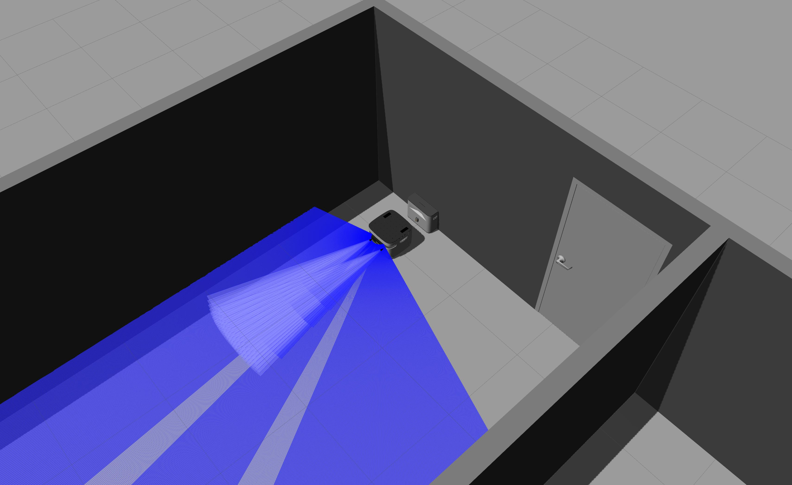
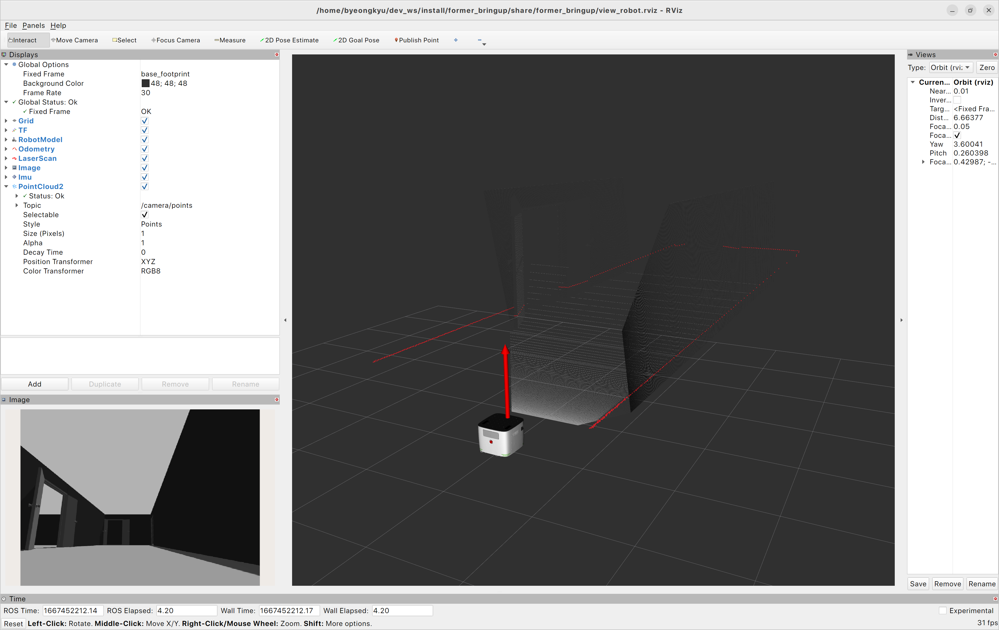

# former_gazebo

Gazebo simulation package for former robot

Gazebo version: Gazebo Classic (Gazebo-11)

## Usage

```shell
$ ros2 launch former_gazebo bringup.launch.py world_name:=office_building.world
```

<center></center>

<br/>

## Control

```shell
$ ros2 run teleop_twist_keyboard teleop_twist_keyboard --ros-args -r cmd_vel:=base_controller/cmd_vel_unstamped
```

## View on rviz2

```shell
$ rviz2 -d `ros2 pkg prefix former_bringup`/share/former_bringup/view_robot.rviz
```
<center></center>
